### 기술스택

---

  - Unity
    - 2020.3.25f1 (LTS)
  - Unity Hub
    - 3.0.0
  - MySQL
    - 5.7.x / 5.7.35
  - Node.js
    - node-v16.13.1-x64.msi -> 최신 버전 다운로드
  - Visual Studio Code
    - ESLint, EditorConfig for VS Code, vscode-icons, Prettier
  - Visual Studio
    - 2019, community
  - Agora
    - 가장 최근 패치 버전이 아닌 원본 package만 사용
    - https://github.com/AgoraIO-Community/Agora_Unity_WebGL
  - Heroku
    - 서버 배포
    - https://ssafycrime.herokuapp.com/


### 빌드 세팅 상세

---

  - Unity Build
    - UnityBuild_1
    
      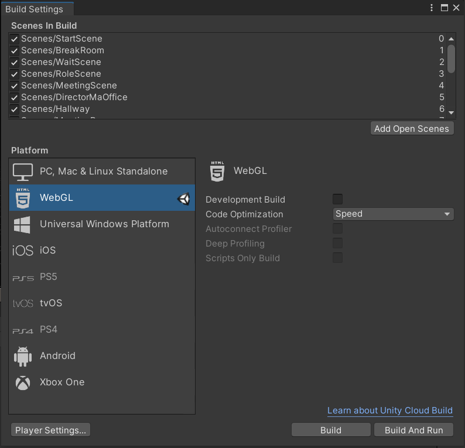
    
    - file -> Build Settings -> WebGL -> Player Settings
    
    - UnityBuild_2
    
      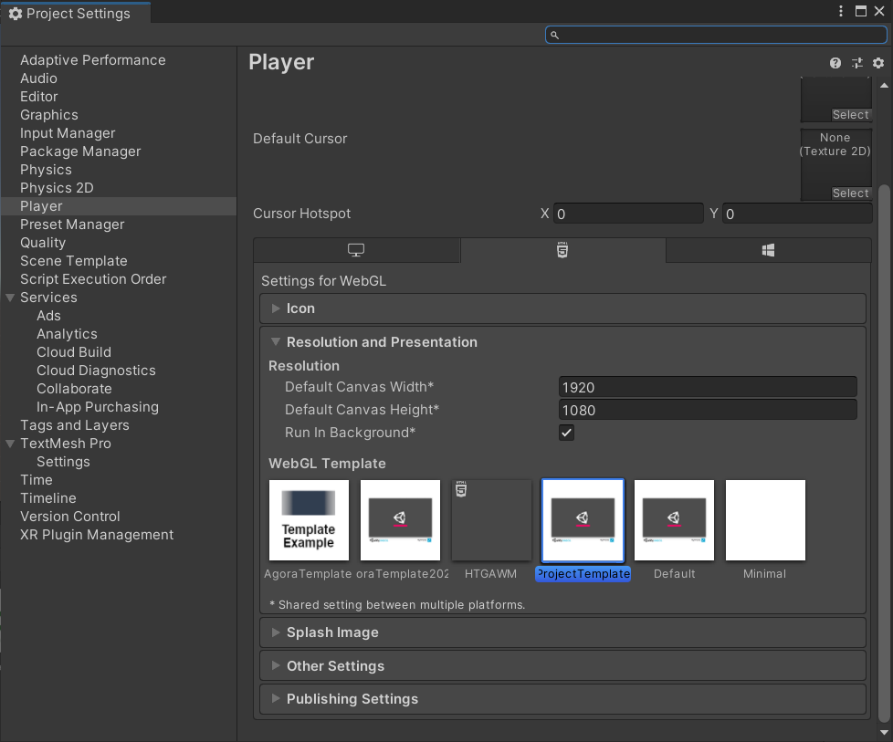
    
    - Player -> WebGL -> Resolution and Presentation -> WebGL Template -> ProjectTemplate
    
    - UnityBuild_3
    
      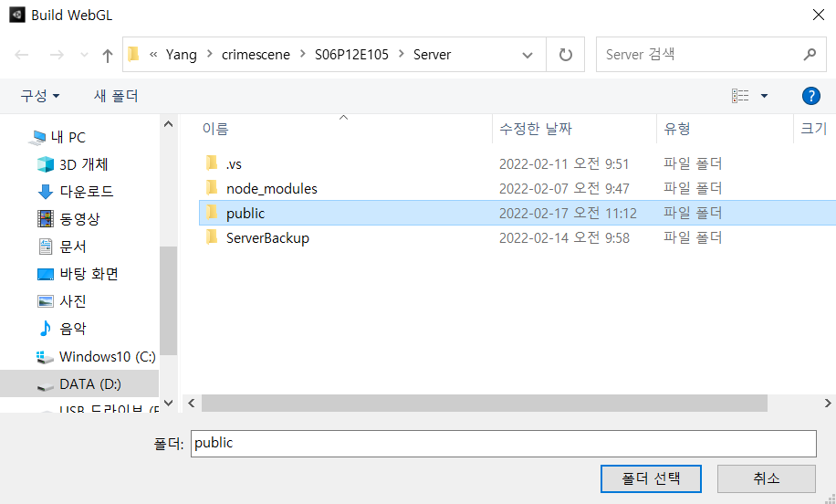
    
    - Server 폴더 안에 있는 public 선택 후 빌드
    
  - NodeJS

    ```bash
    $ npm install
    $ node server.js #로컬 호스트 진행
    ```


### 배포 시 특이사항 기재

----

  - Heroku
    - 30분 마다 트래픽이 존재하지 않을 경우 sleep
    - https://puzzled-carpenter-bec.notion.site/Heroku-a935d2419c674bfc8aaaee51ed9010da


### DB 접속 프로퍼티 파일 목록

---

exec/DB/

- DBProperty.PNG

  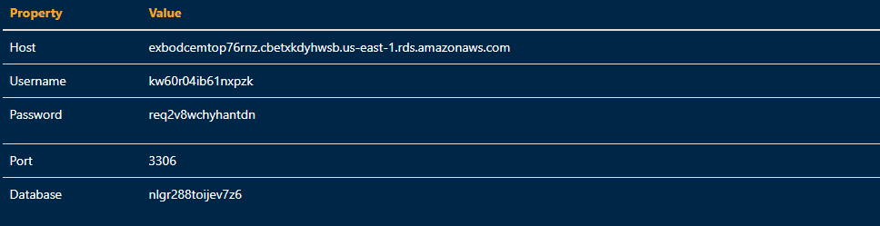

- [Property_URL](DB/Property_URL.md)

- DB_DUMP.zip

- DB_ERD.mwb

  

### 시연 시나리오

--------

- 회원가입

  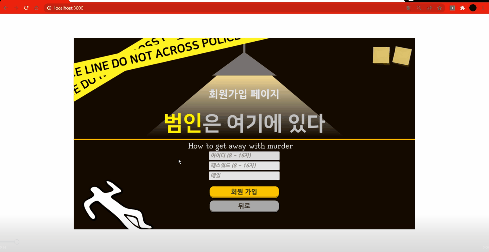

- 로그인

  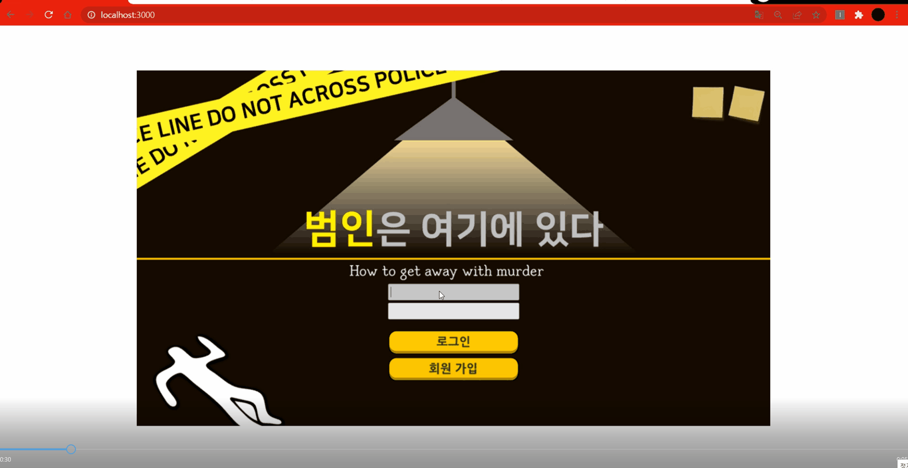

- 마이페이지

  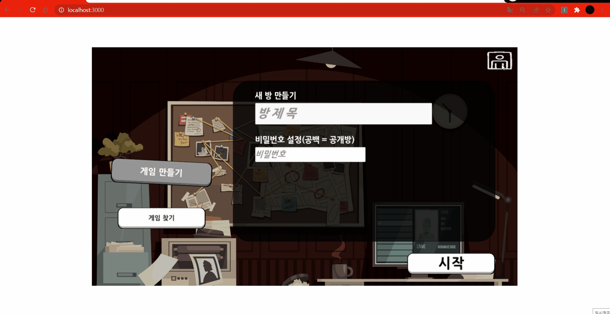

  - 정보 수정 버튼

    - 회원 아이디, 비밀번호, 메일 수정

  - 회원 탈퇴

    - 회원 db 삭제

      

- 게임 생성

  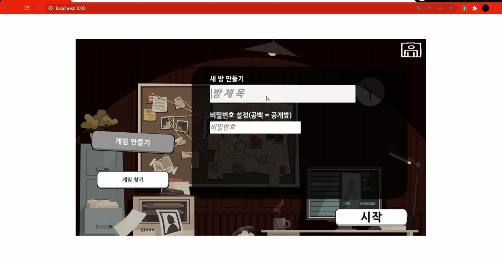


- 게임 참가

  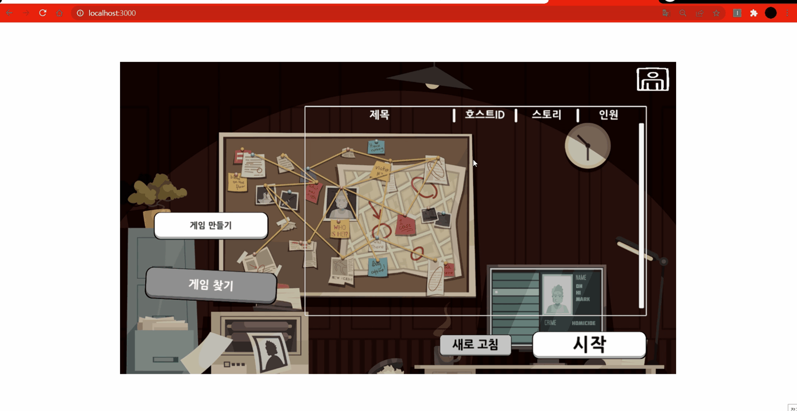


- 로비 소리 설정

  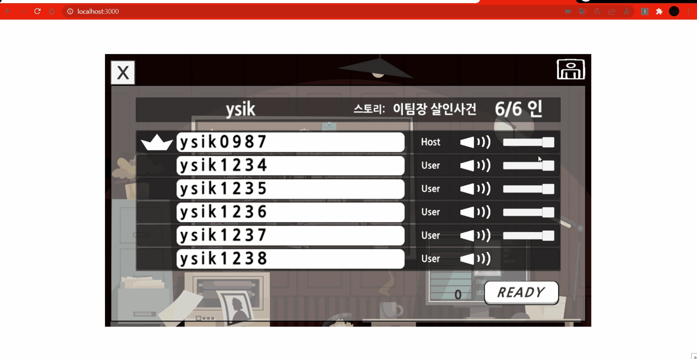


- 게임 설명

  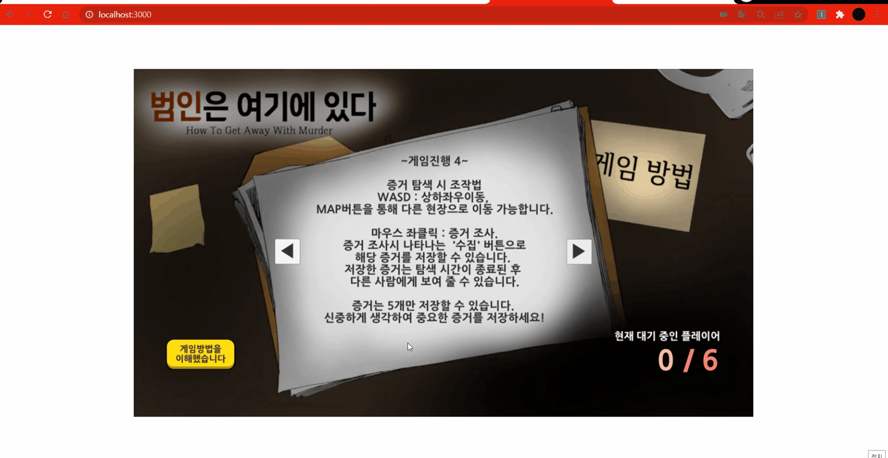


- 역할 설명

  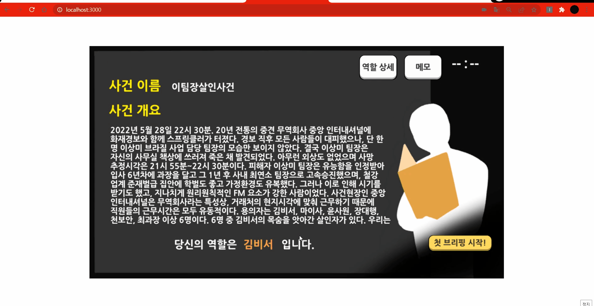


- 회의 기능

  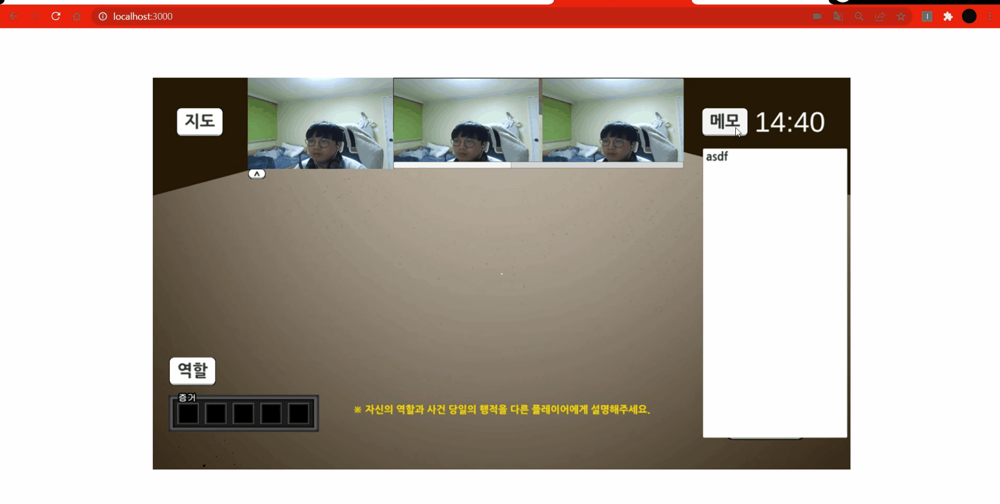


- 맵 선택

  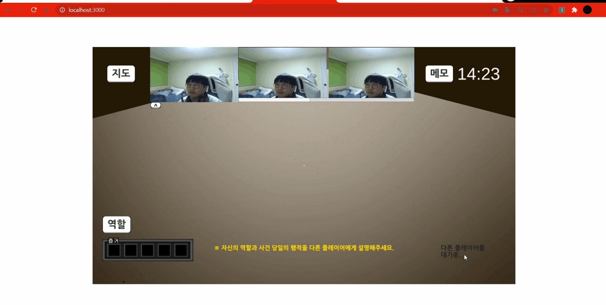


- 증거 선택

  


- 증거 수집

  


- 탐색 씬에서 맵 선택

  


- 증거 공유 

  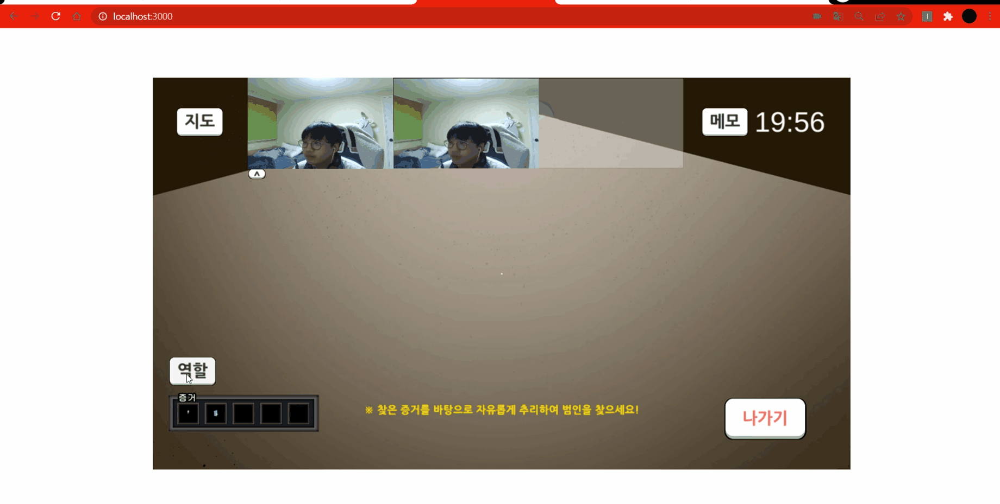


- 투표

  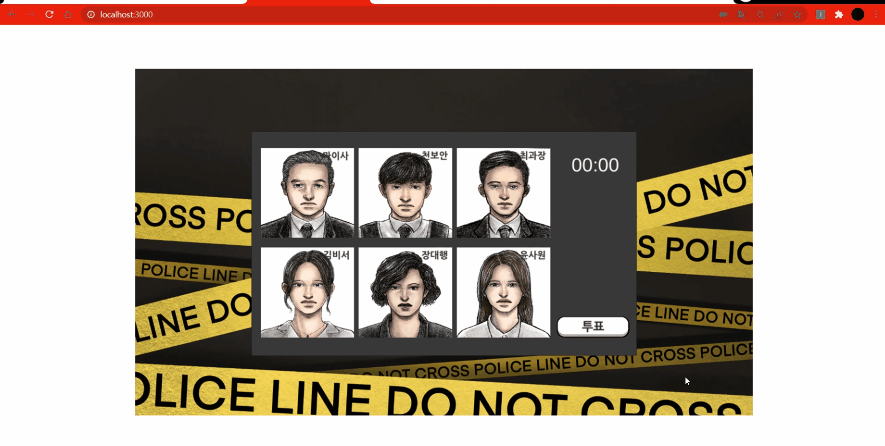


- 결과 타이핑

  


- 결과

  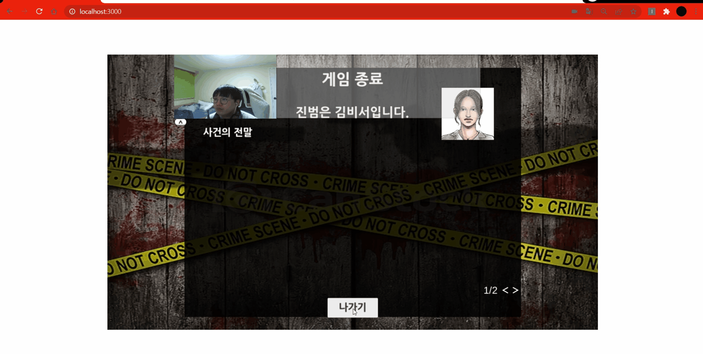

  
